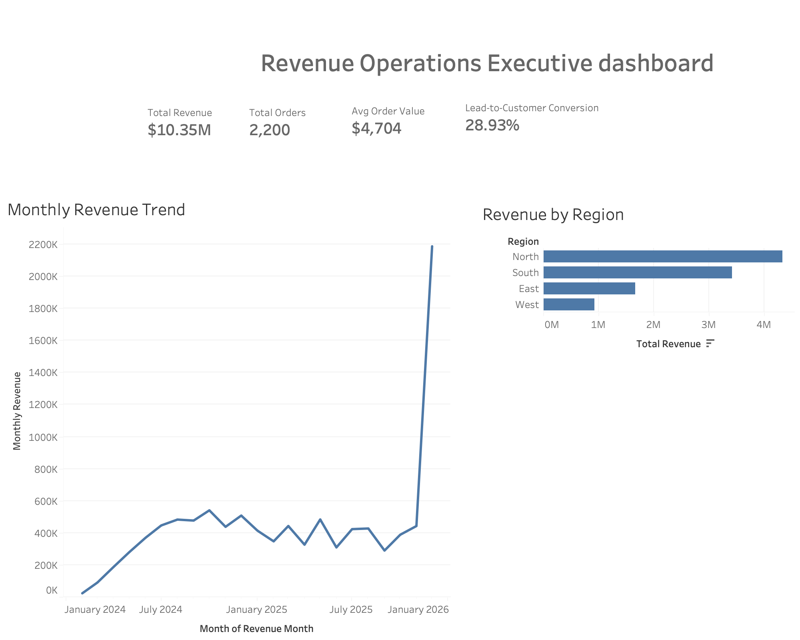

# Revenue Operations Executive Dashboard

## Overview
This project analyzes revenue performance through an executive-level Tableau dashboard built from structured CSV datasets. It focuses on core business KPIs, monthly revenue trends, and regional revenue distribution to support performance monitoring and decision-making.

## Business Questions Answered
- How much total revenue was generated?
- How many total orders were placed?
- What is the average order value?
- What is the lead-to-customer conversion rate?
- How has revenue changed over time?
- Which regions generate the most revenue?

## Key KPIs
- **Total Revenue:** $10.35M
- **Total Orders:** 2,200
- **Average Order Value:** $4,704
- **Lead-to-Customer Conversion Rate:** 28.93%

## Visualizations
- Monthly Revenue Trend
- Revenue by Region
- Executive KPI summary cards

## Tools Used
- Tableau
- CSV datasets
- Business KPI analysis

## Key Insights
- Revenue reached **$10.35M** across **2,200 orders**.
- The business maintained a strong average order value of **$4,704**.
- Lead-to-customer conversion stood at **28.93%**.
- **North** was the top-performing region, followed by **South**.
- Monthly revenue showed variability across the year, with a major spike in the final period.

## Project Files
- `Revenue_Operations_Executive_Dashboard.twbx` — Tableau dashboard workbook
- `dashboard_preview.png` — exported dashboard image
- `monthly_revenue.csv` — monthly revenue data
- `revenue_by_region.csv` — regional revenue data
- `executive_kpis.csv` — top-level KPI values
- `conversion_kpis.csv` — conversion KPI values

## Purpose
This project demonstrates the ability to build an executive dashboard for revenue performance monitoring using Tableau, KPI-based analysis, and business-focused visual storytelling.

## Dashboard Preview

